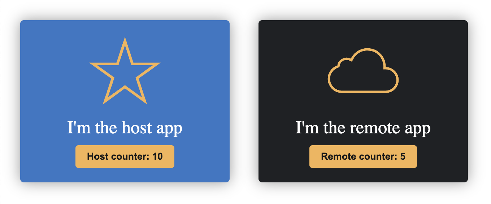

# Remix host and remote

## Not working yet 

This import is never resolved ( no errors ) 😮‍💨

```
const Remote = lazy(
  async () => import('remote/remote-app'),
);
```


## Getting started

From this directory execute:

- npm run install:deps
- npm run preview

Open your browser at http://localhost:4173/ to see the <!-- amazing --> result

<!--  -->
